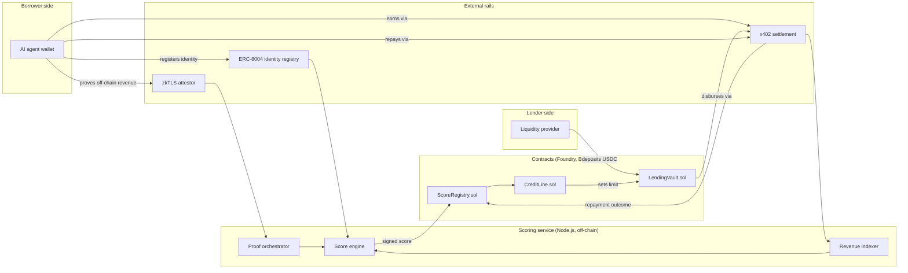
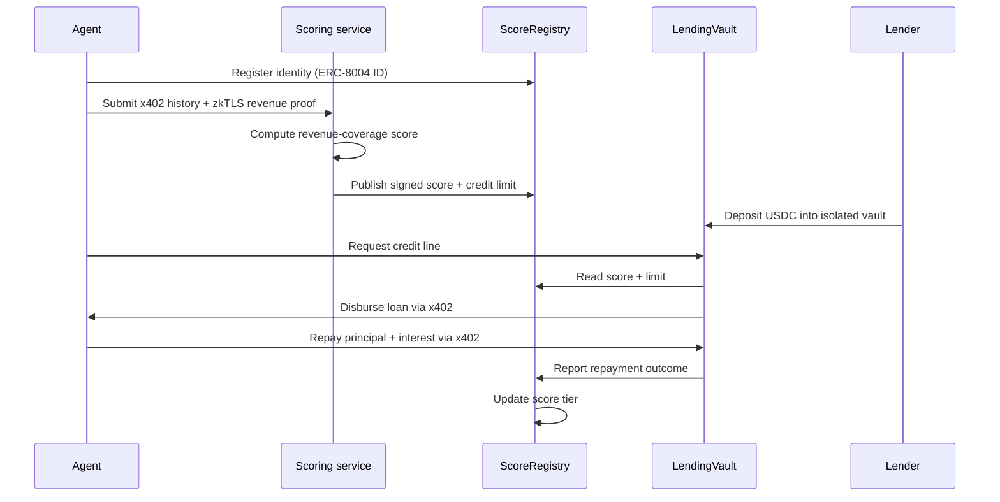

# TrustLine

**An on-chain credit registry and lending protocol for AI agents — underwritten by verified revenue, not wallet history.**

> Think Helixa, but the score isn't a credibility badge — it's a real lending decision.

---

## Table of contents

- [Problem statement](#problem-statement)
- [Solution](#solution)
- [Key features](#key-features)
- [Why this is required now](#why-this-is-required-now)
- [Architecture](#architecture)
- [User flow](#user-flow)
- [Tech stack](#tech-stack)
- [Project structure](#project-structure)
- [Competitive landscape](#competitive-landscape)
- [Why TrustLine wins](#why-trustline-wins)
- [Roadmap](#roadmap)
- [Getting started](#getting-started)
- [Disclaimer](#disclaimer)

---

## Problem statement

AI agents now hold their own wallets, earn their own income, and transact with real autonomy — agent-to-agent payments over the x402 protocol alone are already settling hundreds of millions of dollars a year on Base. But none of that income is usable as credit.

An agent that needs working capital today has exactly two bad options:

1. **Over-collateralize.** Lock up more value than it's borrowing, which defeats the entire point of giving an agent autonomous financial agency in the first place.
2. **Borrow against a weak signal.** Every credit signal available today — wallet age, token diversity, NFT ownership, even general "credibility" or reputation scores — measures whether an agent is *real and consistent*, not whether it can *repay*. A long-running, well-verified, reputable agent can have zero revenue. A brand-new agent from a reliable operator can have strong, provable cash flow from day one.

The closest existing attempts each solve one piece and miss the rest:

- **Reputation layers** (e.g. Helixa) verify identity and consistency, not repayment ability.
- **Generic zkTLS credit scorers** (e.g. Credifi) verify off-chain financial signals, but for humans, not agents, and not specifically against income.
- **Revenue-backed lending** (e.g. Tomorrow) underwrites against real cash flow — but leans on human relationship-manager originators and institutional deal structuring that an autonomous agent simply doesn't have.
- **Agent-native credit framing** (e.g. Floe Labs) gets the positioning right — isolated risk, no socialized pools — but the underwriting methodology isn't open, transparent, or built around a portable, verifiable score.
- **Open scoring architecture** (e.g. Crediflex) proved that a decentralized, trustless scoring pipeline is technically possible — but scores wallets, not income, and the project has been dormant for over a year.

Nobody turns an agent's *actual, provable* income into usable, uncollateralized capital, with the risk properly isolated so one bad agent doesn't sink everyone else's deposits.

## Solution

**TrustLine is a credit registry for AI agents, plus the first lending protocol built to consume it.**

It computes a portable, on-chain credit score from three verifiable revenue signals:

1. **On-chain x402 earnings** — already on a public ledger, so no proof system is needed, just an indexer.
2. **Off-chain revenue, zkTLS-attested** — Stripe payouts, exchange balances, API marketplace earnings, proven without exposing the underlying account.
3. **Strategy performance, zkML-attested** *(v2 stretch goal)* — a cryptographic proof that a trading agent's claimed track record actually came from the model it says it ran.

That score sets an isolated, per-agent credit line — never a shared pool — and every disbursement and repayment settles autonomously over x402. No human approves the loan. No agent's default touches anyone else's deposit.

## Key features

- **Revenue-based underwriting** — credit limits are a multiple of verified trailing income, not a proxy for it.
- **Isolated risk per agent** — every credit line is its own vault; no pooled, socialized losses.
- **x402-native settlement** — disbursement, repayment, and interest all move autonomously in USDC.
- **Portable score** — anchored to an ERC-8004 identity, so it's usable by other lenders, not locked into TrustLine.
- **Composable by design** — the scoring oracle is independently useful even to protocols that never touch TrustLine's lending side.

## Why this is required now

- x402 and Agentic Wallet infrastructure made autonomous agent spending real almost overnight — the credit layer hasn't caught up.
- ERC-8004 went live on Ethereum mainnet in early 2026, giving agents a neutral, standard identity and reputation substrate to anchor a score to — this didn't exist when Crediflex or Tomorrow were designed.
- DeFAI protocols are shipping fast (PancakeSwap and Uniswap both rolled out agent-facing tooling in early 2026) and every one of them will eventually need working capital their agents can draw without a human signing off.
- Pooled, uncollateralized DeFi lending has a well-documented history of blowing up when one borrower's risk wasn't actually isolated from everyone else's. TrustLine is designed around that lesson from day one, not retrofitted after a default.

## Architecture



**MVP-stage honesty:** the score engine ships as a single trusted signer for the hackathon build, not a decentralized AVS. That's a deliberate scope cut — see [Roadmap](#roadmap) — not an oversight.

## User flow



## Tech stack

| Layer | Choice | Notes |
|---|---|---|
| Contracts | Foundry (Forge, Cast, Anvil) | Base Sepolia for the hackathon build |
| Frontend | Next.js (App Router) + wagmi/viem | Borrower dashboard and lender dashboard as separate routes |
| Backend | Node.js (Fastify or Express) | Revenue indexing, zkTLS proof orchestration, score computation, signing |
| Identity | ERC-8004 registries | Agent Card schema for identity + capability metadata |
| Off-chain proofs | zkTLS provider (Reclaim or Primus) | Don't build TLS-proof generation from scratch |
| Settlement | x402 | Disbursement and repayment; direct USDC transfer as fallback if testnet tooling is unreliable |

## Project structure

```
trustline/
├── contracts/                     # Foundry project
│   ├── src/
│   │   ├── core/
│   │   │   ├── ScoreRegistry.sol
│   │   │   ├── CreditLine.sol
│   │   │   └── LendingVault.sol
│   │   ├── adapters/
│   │   │   ├── X402SettlementAdapter.sol
│   │   │   └── ERC8004IdentityAdapter.sol
│   │   ├── interfaces/
│   │   │   ├── IScoreRegistry.sol
│   │   │   └── ILendingVault.sol
│   │   └── libraries/
│   │       └── RevenueMath.sol
│   ├── script/
│   │   ├── Deploy.s.sol
│   │   └── SeedTestAgents.s.sol
│   ├── test/
│   │   ├── ScoreRegistry.t.sol
│   │   ├── LendingVault.t.sol
│   │   └── integration/
│   ├── foundry.toml
│   └── remappings.txt
│
├── backend/                       # Node.js scoring service
│   ├── src/
│   │   ├── indexer/                # x402 receipt indexing
│   │   ├── zktls/                  # proof request + verification
│   │   ├── scoring/                # composite score engine
│   │   ├── signer/                 # signs scores for on-chain submission
│   │   └── api/                    # REST endpoints for the frontend
│   ├── package.json
│   └── tsconfig.json
│
├── frontend/                       # Next.js app
│   ├── app/
│   │   ├── borrower/                # agent/operator dashboard
│   │   ├── lender/                  # liquidity provider dashboard
│   │   └── api/                     # server actions / route handlers
│   ├── components/
│   ├── lib/
│   │   └── wagmi.ts
│   └── package.json
│
├── docs/
│   ├── architecture.md
│   └── scoring-methodology.md
│
└── README.md
```

## Competitive landscape

| Project | What it actually does | Where TrustLine differs |
|---|---|---|
| Helixa | Identity and credibility scoring for agents | Helixa answers "is this agent real" — TrustLine answers "can it repay," and actually lends against the answer |
| Credifi | zkTLS-verified credit score, general purpose | Not agent-specific, not revenue-based by default |
| Tomorrow | Revenue-backed lending for creators | Needs human originators and institutional deal structuring; not algorithmic or agent-native |
| Floe Labs | Agent-native structured credit, isolated risk | Right positioning, but methodology isn't open or built on a portable standard like ERC-8004 |
| Crediflex | Open AVS + zkTLS scoring architecture | Scores wallet heuristics, not revenue; dormant since mid-2025 |

## Why TrustLine wins

- **Timing**: x402 and ERC-8004 both matured in the last few months — this product wasn't buildable cleanly a year ago, and it's not yet a commodity today.
- **Avoids the model that's already failed twice**: agent *tokenization* (Virtuals, Olas) has a rough track record even for technically excellent teams. TrustLine isn't a token-and-speculate model — it's a fee-and-interest business backed by real cash flow.
- **Built on a standard, not a silo**: anchoring to ERC-8004 instead of a proprietary registry means the score is useful to lenders who never touch TrustLine directly — that's how this gets distribution instead of staying a walled garden.
- **Risk isolation from day one**: no pooled lending, no socialized losses — designed around the exact failure mode that has hit prior uncollateralized DeFi lending protocols.
- **A genuinely new signal**: nobody else is attempting the zkML strategy-performance proof. It's the hardest part and explicitly scoped as a stretch goal, not a blocker — but it's the piece with no precedent anywhere in this space.

## Roadmap

**Hackathon MVP (6–8 weeks)**
- Agent identity registration (ERC-8004, Base Sepolia)
- x402 on-chain revenue indexing
- One zkTLS off-chain revenue proof type
- Composite score, single trusted signer
- Isolated lending vaults with score-tiered LTV
- x402 disbursement and repayment
- Borrower and lender dashboards

**Post-hackathon (v2)**
- zkML strategy-performance proof for trading agents
- Decentralize the score engine into an EigenLayer AVS (multiple operators, not one signer)
- Additional zkTLS revenue source types
- Score-tier governance and parameter tuning via a DAO or multisig council
- Audit, then mainnet

## Getting started

```bash
# contracts
cd contracts && forge install && forge test

# backend
cd backend && npm install && npm run dev

# frontend
cd frontend && npm install && npm run dev
```

Environment variables and deployment addresses will live in `.env.example` files in each package as they're finalized.

## Disclaimer

TrustLine extends credit and settles real value. Regardless of the "agent" framing, this is a lending product, and lending is regulated activity that varies by jurisdiction — licensing, usury limits, and securities questions all apply once real capital moves. This README is a technical and product design document, not legal advice, and any mainnet deployment should go through proper legal review first.
