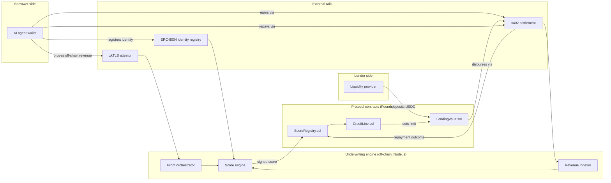

# TrustLine

**An on-chain, credit-based lending protocol for AI agents — borrowing power is underwritten by verified revenue, not wallet history.**

> Think Helixa, but the score isn't a credibility badge — it's a real lending decision.

---

## Table of contents

- [Problem statement](#problem-statement)
- [Solution](#solution)
- [Key features](#key-features)
- [Why this is required now](#why-this-is-required-now)
- [Architecture](#architecture)
- [User flow](#user-flow)
- [Tech stack](#tech-stack)
- [Project structure](#project-structure)
- [Competitive landscape](#competitive-landscape)
- [Why TrustLine wins](#why-trustline-wins)
- [Risk model and economics](#risk-model-and-economics)
- [Roadmap](#roadmap)
- [Getting started](#getting-started)
- [License](#license)
- [Disclaimer](#disclaimer)

---

## Problem statement

AI agents now hold their own wallets, earn their own income, and transact with real autonomy — agent-to-agent payments over the x402 protocol alone are already settling hundreds of millions of dollars a year on Base. But none of that income is usable as credit.

An agent that needs working capital today has exactly two bad options:

1. **Over-collateralize.** Lock up more value than it's borrowing, which defeats the entire point of giving an agent autonomous financial agency in the first place.
2. **Borrow against a weak signal.** Every credit signal available today — wallet age, token diversity, NFT ownership, even general "credibility" or reputation scores — measures whether an agent is *real and consistent*, not whether it can *repay*. A long-running, well-verified, reputable agent can have zero revenue. A brand-new agent from a reliable operator can have strong, provable cash flow from day one.

The closest existing attempts each solve one piece and miss the rest:

- **Reputation layers** (e.g. Helixa) verify identity and consistency, not repayment ability.
- **Generic zkTLS credit scorers** (e.g. Credifi) verify off-chain financial signals, but for humans, not agents, and not specifically against income.
- **Revenue-backed lending** (e.g. Tomorrow) underwrites against real cash flow — but leans on human relationship-manager originators and institutional deal structuring that an autonomous agent simply doesn't have.
- **Agent-native credit framing** (e.g. Floe Labs) gets the positioning right — isolated risk, no socialized pools — but the underwriting methodology isn't open, transparent, or built around a portable, verifiable score.
- **Open scoring architecture** (e.g. Crediflex) proved that a decentralized, trustless scoring pipeline is technically possible — but scores wallets, not income, and the project has been dormant for over a year.

Nobody turns an agent's *actual, provable* income into usable, uncollateralized capital, with the risk properly isolated so one bad agent doesn't sink everyone else's deposits.

## Solution

**TrustLine is one protocol: it lends to AI agents, sized against their verified revenue, instead of requiring collateral or trusting a reputation score that was never built to predict repayment.**

An agent registers, gets underwritten, borrows, and repays — that's the whole product from the outside. Under the hood, borrowing power comes from three verifiable revenue signals, computed as part of the same lending flow rather than as a separate product an agent has to go get first:

1. **On-chain x402 earnings** — already on a public ledger, so no proof system is needed, just an indexer.
2. **Off-chain revenue, zkTLS-attested** — Stripe payouts, exchange balances, API marketplace earnings, proven without exposing the underlying account.
3. **Strategy performance, zkML-attested** *(v2 stretch goal)* — a cryptographic proof that a trading agent's claimed track record actually came from the model it says it ran.

Every credit line TrustLine opens is isolated to that one agent — never a shared pool — and every disbursement and repayment settles autonomously over x402. No human approves the loan. No agent's default touches anyone else's deposit.

## Key features

- **Revenue-based underwriting** — credit limits are a multiple of verified trailing income, not a proxy for it.
- **Isolated risk per agent** — every credit line is its own vault; no pooled, socialized losses.
- **x402-native settlement** — disbursement, repayment, and interest all move autonomously in USDC.
- **Portable score** — anchored to an ERC-8004 identity, so it's usable by other lenders, not locked into TrustLine.
- **Composable by design** — the underwriting logic is exposed on-chain, so other lenders can read an agent's TrustLine standing even if they never use TrustLine's own credit lines.

## Why this is required now

- x402 and Agentic Wallet infrastructure made autonomous agent spending real almost overnight — the credit layer hasn't caught up.
- ERC-8004 went live on Ethereum mainnet in early 2026, giving agents a neutral, standard identity and reputation substrate to anchor a score to — this didn't exist when Crediflex or Tomorrow were designed.
- DeFAI protocols are shipping fast (PancakeSwap and Uniswap both rolled out agent-facing tooling in early 2026) and every one of them will eventually need working capital their agents can draw without a human signing off.
- Pooled, uncollateralized DeFi lending has a well-documented history of blowing up when one borrower's risk wasn't actually isolated from everyone else's. TrustLine is designed around that lesson from day one, not retrofitted after a default.

## Architecture

TrustLine has two technical layers that only function together — neither does anything useful on its own. An off-chain underwriting engine computes borrowing power; on-chain contracts hold funds and enforce whatever it decides. That's one protocol with a hybrid execution model, the same way most lending markets lean on an oracle without being "two products."



**MVP-stage honesty:** the underwriting engine runs as a single trusted signer for the hackathon build, not a decentralized AVS. That's a deliberate scope cut — see [Roadmap](#roadmap) — not an oversight.

## User flow


## Tech stack

| Layer | Choice | Notes |
|---|---|---|
| Contracts | Foundry (Forge, Cast, Anvil) | Base Sepolia for the hackathon build |
| Frontend | Next.js (App Router) + wagmi/viem | Borrower dashboard and lender dashboard as separate routes |
| Backend | Node.js (Fastify or Express) | Revenue indexing, zkTLS proof orchestration, score computation, signing |
| Identity | ERC-8004 registries | Agent Card schema for identity + capability metadata |
| Off-chain proofs | zkTLS provider (Reclaim or Primus) | Don't build TLS-proof generation from scratch |
| Settlement | x402 | Disbursement and repayment; direct USDC transfer as fallback if testnet tooling is unreliable |

## Project structure

```
trustline/
├── contracts/                     # Foundry project
│   ├── src/
│   │   ├── core/
│   │   │   ├── ScoreRegistry.sol
│   │   │   ├── CreditLine.sol
│   │   │   └── LendingVault.sol
│   │   ├── adapters/
│   │   │   ├── X402SettlementAdapter.sol
│   │   │   └── ERC8004IdentityAdapter.sol
│   │   ├── interfaces/
│   │   │   ├── IScoreRegistry.sol
│   │   │   └── ILendingVault.sol
│   │   └── libraries/
│   │       └── RevenueMath.sol
│   ├── script/
│   │   ├── Deploy.s.sol
│   │   └── SeedTestAgents.s.sol
│   ├── test/
│   │   ├── ScoreRegistry.t.sol
│   │   ├── LendingVault.t.sol
│   │   └── integration/
│   ├── foundry.toml
│   └── remappings.txt
│
├── backend/                       # Node.js underwriting engine (off-chain layer of the protocol)
│   ├── src/
│   │   ├── indexer/                # x402 receipt indexing
│   │   ├── zktls/                  # proof request + verification
│   │   ├── scoring/                # composite score engine
│   │   ├── signer/                 # signs scores for on-chain submission
│   │   └── api/                    # REST endpoints for the frontend
│   ├── package.json
│   └── tsconfig.json
│
├── frontend/                       # Next.js app
│   ├── app/
│   │   ├── borrower/                # agent/operator dashboard
│   │   ├── lender/                  # liquidity provider dashboard
│   │   └── api/                     # server actions / route handlers
│   ├── components/
│   ├── lib/
│   │   └── wagmi.ts
│   └── package.json
│
├── docs/
│   ├── architecture.md
│   └── scoring-methodology.md
│
└── README.md
```

## Competitive landscape

| Project | What it actually does | Where TrustLine differs |
|---|---|---|
| Helixa | Identity and credibility scoring for agents | Helixa answers "is this agent real" — TrustLine answers "can it repay," and actually lends against the answer |
| Credifi | zkTLS-verified credit score, general purpose | Not agent-specific, not revenue-based by default |
| Tomorrow | Revenue-backed lending for creators | Needs human originators and institutional deal structuring; not algorithmic or agent-native |
| Floe Labs | Agent-native structured credit, isolated risk | Right positioning, but methodology isn't open or built on a portable standard like ERC-8004 |
| Crediflex | Open AVS + zkTLS scoring architecture | Scores wallet heuristics, not revenue; dormant since mid-2025 |

## Why TrustLine wins

- **Timing**: x402 and ERC-8004 both matured in the last few months — this product wasn't buildable cleanly a year ago, and it's not yet a commodity today.
- **Avoids the model that's already failed twice**: agent *tokenization* (Virtuals, Olas) has a rough track record even for technically excellent teams. TrustLine isn't a token-and-speculate model — it's a fee-and-interest business backed by real cash flow.
- **Built on a standard, not a silo**: TrustLine anchors its underwriting to ERC-8004 instead of inventing a proprietary registry, so other lenders can read an agent's TrustLine standing even if they never touch TrustLine's own credit lines — that's how this gets distribution instead of staying a walled garden.
- **Risk isolation from day one**: no pooled lending, no socialized losses — designed around the exact failure mode that has hit prior uncollateralized DeFi lending protocols.
- **A genuinely new signal**: nobody else is attempting the zkML strategy-performance proof. It's the hardest part and explicitly scoped as a stretch goal, not a blocker — but it's the piece with no precedent anywhere in this space.

## Risk model and economics

These were the most significant open questions in the design — worth answering explicitly here rather than leaving them implicit.

**How a lender is actually protected.** Isolating risk per agent (no pooled vaults) stops one agent's default from touching another lender's deposit — it does not eliminate risk for the lender exposed to that specific agent. For the MVP, that's intentional and transparent: a lender chooses which agent's credit line to fund, sees that agent's underwriting history before depositing, and accepts agent-specific default risk in exchange for a higher yield than a pooled market would pay. A protocol-level reserve fund, capitalized from a slice of origination fees, is a natural v2 addition for lenders who'd rather diversify than pick agents directly — out of scope for the hackathon build, called out here so it doesn't look like an oversight.

**Interest rate model.** MVP default: a fixed APR per underwriting tier, set when a lender funds a specific agent's credit line, rather than a pooled utilization curve — utilization curves matter when liquidity is shared across many borrowers, which doesn't apply cleanly to isolated, single-agent vaults. Rate bands per tier are a parameter to tune against real test data, not a number to lock in before any exists.

**Sybil and wash-trading resistance.** The most exploitable attack on this whole model: an operator pays their own agent from a second wallet they also control, manufacturing fake x402 "revenue." MVP mitigation: revenue only counts toward underwriting if it comes from a minimum number of independently-identified counterparties, and zkTLS-proved off-chain revenue is weighted more heavily, since faking a real Stripe or exchange account is a meaningfully higher bar than looping a wallet. This needs real anti-Sybil heuristics beyond the hackathon scope — flagging it now rather than letting it surface during judging or, worse, after a real deposit.

**No speculative token.** TrustLine does not have a governance or rewards token, by design. The neighboring category — agent tokenization, à la Virtuals and Olas — has a rough track record specifically because token speculation became the product instead of the underlying credit business. TrustLine's revenue is interest spread and origination fees on real loans, not token issuance. Stating this outright so it isn't assumed by omission.

## Roadmap

**Hackathon MVP (6–8 weeks)**
- Agent identity registration (ERC-8004, Base Sepolia)
- x402 on-chain revenue indexing
- One zkTLS off-chain revenue proof type
- Composite score, single trusted signer
- Isolated lending vaults with score-tiered LTV
- x402 disbursement and repayment
- Borrower and lender dashboards

**Post-hackathon (v2)**
- zkML strategy-performance proof for trading agents
- Decentralize the score engine into an EigenLayer AVS (multiple operators, not one signer)
- Additional zkTLS revenue source types
- Score-tier governance and parameter tuning via a DAO or multisig council
- Audit, then mainnet

## Getting started

```bash
# contracts
cd contracts && forge install && forge test

# backend
cd backend && npm install && npm run dev

# frontend
cd frontend && npm install && npm run dev
```

Environment variables and deployment addresses will live in `.env.example` files in each package as they're finalized.

## License

MIT — consistent with the open, standards-based positioning above. Easy to revisit before any public repo or mainnet deployment if the team wants different terms.

## Disclaimer

TrustLine extends credit and settles real value. Regardless of the "agent" framing, this is a lending product, and lending is regulated activity that varies by jurisdiction — licensing, usury limits, and securities questions all apply once real capital moves. This README is a technical and product design document, not legal advice, and any mainnet deployment should go through proper legal review first.
